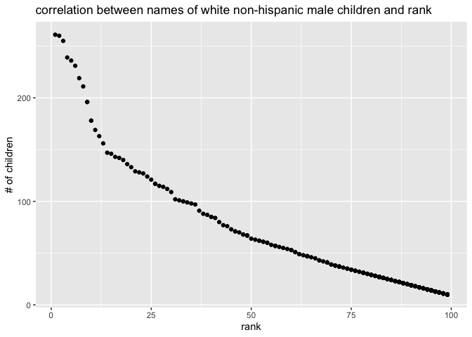

Homework 2
================
Weize Sun
10/6/2021

``` r
library(tidyverse)
```

    ## ── Attaching packages ─────────────────────────────────────── tidyverse 1.3.1 ──

    ## ✓ ggplot2 3.3.5     ✓ purrr   0.3.4
    ## ✓ tibble  3.1.4     ✓ dplyr   1.0.7
    ## ✓ tidyr   1.1.3     ✓ stringr 1.4.0
    ## ✓ readr   2.0.1     ✓ forcats 0.5.1

    ## ── Conflicts ────────────────────────────────────────── tidyverse_conflicts() ──
    ## x dplyr::filter() masks stats::filter()
    ## x dplyr::lag()    masks stats::lag()

## Problem 1

``` r
trash_wheel_df = readxl::read_excel(
  "./data/Trash-Wheel-Collection-Totals-7-2020-2.xlsx",
  sheet = "Mr. Trash Wheel",
  range = "A2:N534") %>% 
  janitor::clean_names() %>% 
  drop_na(dumpster) %>% 
  mutate(sports_balls = round(sports_balls))
```

``` r
pre_19 = readxl::read_excel(
  "./data/Trash-Wheel-Collection-Totals-7-2020-2.xlsx",
  sheet = "2019 Precipitation",
  range = "A2:B14") %>% 
  janitor::clean_names() %>% 
  drop_na(total) %>% 
  mutate(year = 2019) %>% 
  relocate(year)

pre_18 = readxl::read_excel(
  "./data/Trash-Wheel-Collection-Totals-7-2020-2.xlsx",
  sheet = "2018 Precipitation",
  range = "A2:B14") %>% 
  janitor::clean_names() %>% 
  drop_na(total) %>% 
  mutate(year = 2018) %>% 
  relocate(year)

pre_1819 = full_join(pre_18, pre_19) %>% 
  mutate(month = month.name[month])
```

    ## Joining, by = c("year", "month", "total")

``` r
pre_1819
```

    ## # A tibble: 24 × 3
    ##     year month     total
    ##    <dbl> <chr>     <dbl>
    ##  1  2018 January    0.94
    ##  2  2018 February   4.8 
    ##  3  2018 March      2.69
    ##  4  2018 April      4.69
    ##  5  2018 May        9.27
    ##  6  2018 June       4.77
    ##  7  2018 July      10.2 
    ##  8  2018 August     6.45
    ##  9  2018 September 10.5 
    ## 10  2018 October    2.12
    ## # … with 14 more rows

``` r
sum(pull(pre_18, total))
```

    ## [1] 70.33

``` r
ball_19 = filter(trash_wheel_df, year == 2019)
median(pull(ball_19, sports_balls))
```

    ## [1] 9

\*\* The observation of trash\_wheel\_df is 345 with 14 variables, and
we are specifically paying attention to variable *sports\_balls*. The
observation of pre\_1819 is 24, and we are specifically looking at
variable *total*. For available data, the total precipitation in 2018 is
70.33, and the median number of sports balls in a dumpster in 2019 is 9.
\*\*

## Problem 2

``` r
pols_month_df = read.csv("./data/fivethirtyeight_datasets/pols-month.csv") %>% 
  janitor::clean_names() %>% 
  separate(mon, into = c("year", "month", "day"), sep = "-") %>% 
  mutate(month = as.numeric(month)) %>%
  mutate(month = month.name[month]) %>% 
  rename(republic = prez_gop, democratic = prez_dem) %>% 
  pivot_longer(
    c(republic, democratic),
    names_to = "president",
    values_to = "number") %>% 
  filter(number != 0) %>% 
  select(-day, -number) 
```

``` r
snp_df = read.csv("./data/fivethirtyeight_datasets/snp.csv") %>% 
  separate(date, into = c("month", "day", "year"), sep = "/") %>% 
  relocate(year, month) %>% 
  mutate(month = as.numeric(month)) %>% 
  mutate(month = month.name[month]) %>% 
  select(-day) 

snp_before_2000 = filter(snp_df, year >= 20) %>% 
  mutate(year = as.character(as.numeric(year) + 1900))
snp_after_2000 = filter(snp_df, year <= 20) %>% 
  mutate(year = as.character(as.numeric(year) + 2000))

snp_final = bind_rows(snp_before_2000, snp_after_2000)
```

``` r
unemployment_df = read.csv("./data/fivethirtyeight_datasets/unemployment.csv") %>% 
  pivot_longer(
    Jan:Dec,
    names_to = "month",
    values_to = "unemployment"
  ) %>% 
  mutate(month = month.name[match(month,month.abb)]) %>% 
  rename(year = Year) %>% 
  mutate(year = as.character(year))
```

``` r
pols_snp = left_join(pols_month_df, snp_final) 
```

    ## Joining, by = c("year", "month")

``` r
final_df = left_join(pols_snp, unemployment_df)
```

    ## Joining, by = c("year", "month")

``` r
final_df
```

    ## # A tibble: 822 × 11
    ##    year  month   gov_gop sen_gop rep_gop gov_dem sen_dem rep_dem president close
    ##    <chr> <chr>     <int>   <int>   <int>   <int>   <int>   <int> <chr>     <dbl>
    ##  1 1947  January      23      51     253      23      45     198 democrat…    NA
    ##  2 1947  Februa…      23      51     253      23      45     198 democrat…    NA
    ##  3 1947  March        23      51     253      23      45     198 democrat…    NA
    ##  4 1947  April        23      51     253      23      45     198 democrat…    NA
    ##  5 1947  May          23      51     253      23      45     198 democrat…    NA
    ##  6 1947  June         23      51     253      23      45     198 democrat…    NA
    ##  7 1947  July         23      51     253      23      45     198 democrat…    NA
    ##  8 1947  August       23      51     253      23      45     198 democrat…    NA
    ##  9 1947  Septem…      23      51     253      23      45     198 democrat…    NA
    ## 10 1947  October      23      51     253      23      45     198 democrat…    NA
    ## # … with 812 more rows, and 1 more variable: unemployment <dbl>

``` r
dim(pols_month_df)
```

    ## [1] 822   9

``` r
range(pull(pols_month_df, year))
```

    ## [1] "1947" "2015"

``` r
names(pols_month_df)
```

    ## [1] "year"      "month"     "gov_gop"   "sen_gop"   "rep_gop"   "gov_dem"  
    ## [7] "sen_dem"   "rep_dem"   "president"

``` r
dim(snp_final)
```

    ## [1] 787   3

``` r
range(pull(snp_final, year))
```

    ## [1] "1950" "2015"

``` r
names(snp_final)
```

    ## [1] "year"  "month" "close"

``` r
dim(unemployment_df)
```

    ## [1] 816   3

``` r
range(pull(unemployment_df, year))
```

    ## [1] "1948" "2015"

``` r
names(unemployment_df)
```

    ## [1] "year"         "month"        "unemployment"

``` r
dim(final_df)
```

    ## [1] 822  11

``` r
range(pull(final_df, year))
```

    ## [1] "1947" "2015"

``` r
names(final_df)
```

    ##  [1] "year"         "month"        "gov_gop"      "sen_gop"      "rep_gop"     
    ##  [6] "gov_dem"      "sen_dem"      "rep_dem"      "president"    "close"       
    ## [11] "unemployment"

**For pols\_month\_df, the dimension is (822 x 9), the range of year is
(1947, 2015), and key variables is “president”.**

**For snp\_final, the dimension is (787 x 3), the range of year is
(1950, 2015), and key variable is “close”.**

**For unemployment\_df, the dimension is (816 x 3), the range of year is
(1948, 2015), and key variable is “unemployment”.**

**For final\_df, the dimension is (822 x 11), the range of year is
(1947, 2015), and key variable is “president”, “close”,
“unemployment”.**

## Problem 3

``` r
popular_baby_names_df = 
  read.csv("./data/Popular_Baby_Names (1).csv") %>% 
  janitor::clean_names() %>% 
  mutate(ethnicity = recode(ethnicity, "ASIAN AND PACI" = "ASIAN AND PACIFIC ISLANDER",
                            "BLACK NON HISP" = "BLACK NON HISPANIC",
                            "WHITE NON HISP" = "WHITE NON HISPANIC"),
        child_s_first_name = str_to_sentence(child_s_first_name),
        gender = str_to_sentence(gender),
        ethnicity = str_to_sentence(ethnicity))

nrow(popular_baby_names_df)
```

    ## [1] 19418

``` r
popular_baby_names_df = 
  distinct(popular_baby_names_df, .keep_all= TRUE)

nrow(popular_baby_names_df)
```

    ## [1] 12181

``` r
olivia_rank_df = 
  popular_baby_names_df %>%
  filter(child_s_first_name == "Olivia" & gender == "Female") %>%
  select(-gender, -child_s_first_name, -count) %>% 
  pivot_wider(
    names_from = year_of_birth,
    values_from = rank
  )

popular_male_name_df = 
  popular_baby_names_df %>%
  filter(gender == "Male" & rank == 1) %>% 
  select(-gender, -rank, -count) %>% 
  pivot_wider(
    names_from = year_of_birth,
    values_from = child_s_first_name
  )
```

``` r
m_nonhis_2016 = 
  popular_baby_names_df %>% 
  filter(gender == "Male" & ethnicity == "White non hispanic" & year_of_birth == 2016)

ggplot(m_nonhis_2016, aes(x = rank, y = count)) +
  labs(title = "correlation between names of white non-hispanic male children and rank",
       x = "rank",
       y = "# of children") + geom_point()
```

<!-- -->
